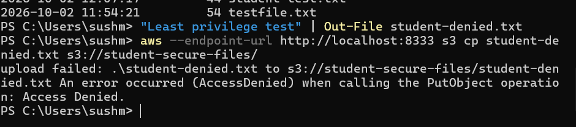
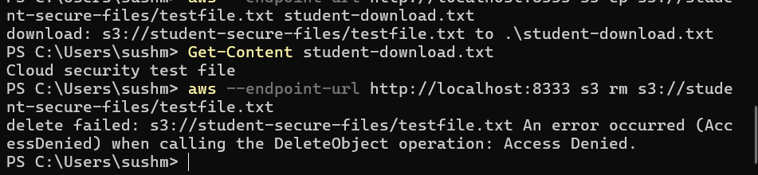
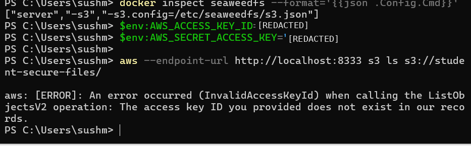
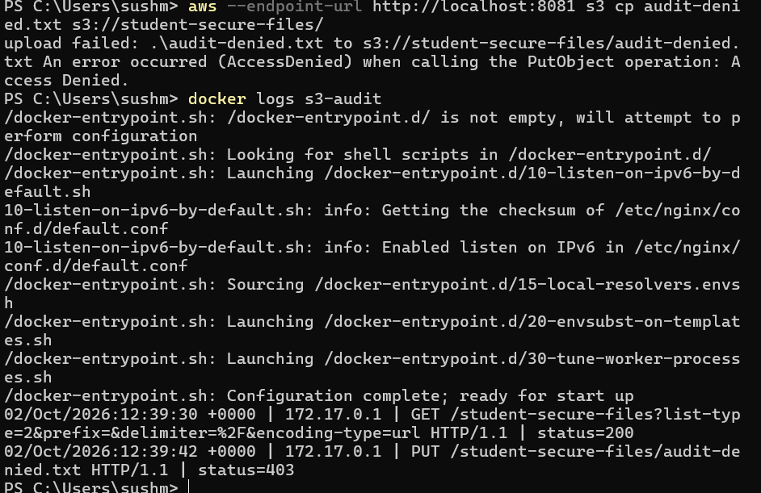
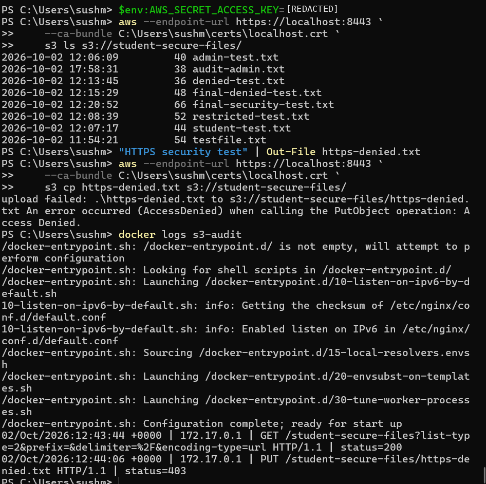
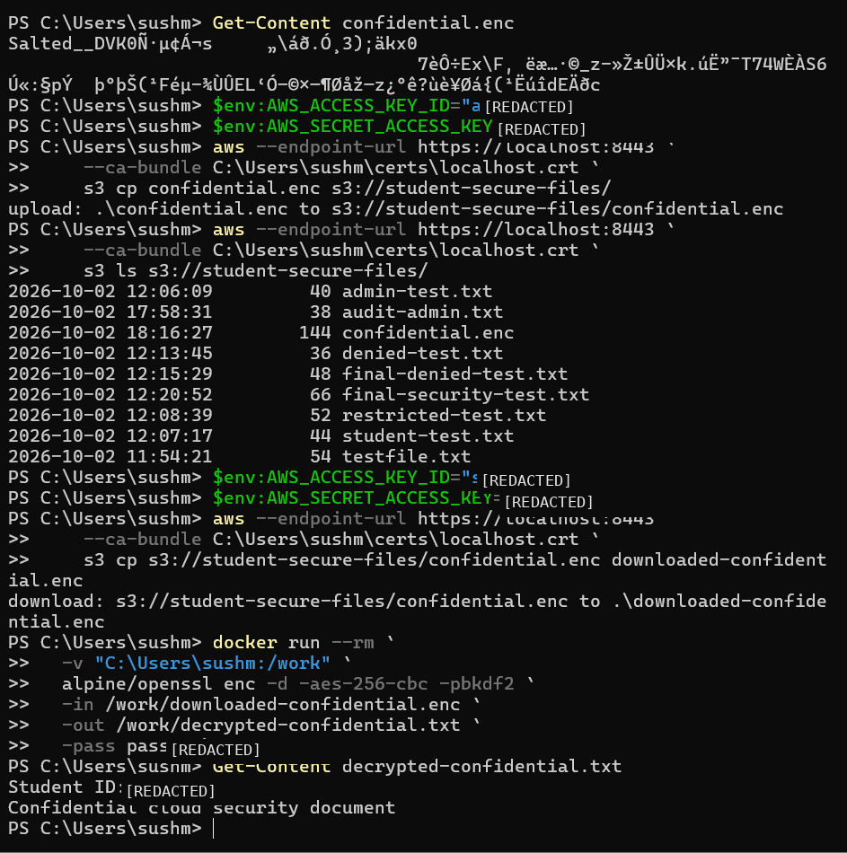

# Local Cloud Security Lab


A beginner cloud-security project that simulates secure S3-compatible object storage locally using Docker, SeaweedFS, AWS CLI, Nginx, and OpenSSL.


## Project Objective


The goal of this project is to understand fundamental cloud-security concepts without requiring a paid cloud account.


The lab demonstrates:


- Authentication

- Authorization

- Least-privilege access

- S3-compatible object storage

- Role-based permissions

- Audit logging

- HTTPS/TLS

- Encryption at rest

- Encryption in transit


## Architecture


```text

AWS CLI

   |

   | HTTPS / TLS

   v

Nginx Audit Proxy

   |

   | Request Logging

   v

SeaweedFS S3 Storage

   |

   +----------------------+

   |                      |

   v                      v

 Admin                 Student

 Read ✅               Read ✅

 Write ✅              List ✅

 Delete ✅             Write ❌

                       Delete ❌

```


Sensitive files are encrypted before storage:


```text

Plaintext File

     |

     | AES-256 Encryption

     v

Encrypted Object

     |

     v

S3-Compatible Storage

```


## Technologies Used


- Docker Desktop

- SeaweedFS

- AWS CLI

- Nginx

- OpenSSL

- PowerShell

- Git

- GitHub


## Access-Control Model


### Admin


The admin user can:


- List objects

- Read objects

- Upload objects

- Delete objects

- Perform administrative operations


### Student


The student user follows the principle of least privilege.


The student can:


- List objects

- Download/read objects


The student cannot:


- Upload objects

- Delete objects


Unauthorized operations return:


```text

AccessDenied

```


## Authentication Testing


The lab verifies that invalid AWS-style credentials are rejected.


Example:


```text

InvalidAccessKeyId

```


This demonstrates that the S3-compatible endpoint requires valid credentials before allowing access.


## Audit Logging


Nginx is used as a reverse proxy in front of the S3-compatible storage service.


Successful requests are recorded with HTTP status codes such as:


```text

GET -> 200

```


Unauthorized operations are recorded as:


```text

PUT -> 403

```


This demonstrates how cloud environments can record successful and failed access attempts for security monitoring and investigation.


## Encryption in Transit


The Nginx proxy uses HTTPS with TLS.


The AWS CLI communicates with the storage service through:


```text

https://localhost:8443

```


TLS protects data while it travels between the client and the storage service.


## Encryption at Rest


Sensitive files are encrypted using AES-256 before being uploaded.


Example flow:


```text

Plaintext File

     |

     | AES-256

     v

Encrypted File

     |

     v

S3-Compatible Storage

```


The encrypted object cannot be meaningfully read without the correct decryption secret.


## Security Concepts Learned


This project demonstrates several core cloud-security principles:


1. **Authentication** — verifying user identity.

2. **Authorization** — controlling what authenticated users can do.

3. **Least Privilege** — granting only the permissions required for a task.

4. **Encryption in Transit** — protecting data while it moves over a network using TLS.

5. **Encryption at Rest** — protecting stored data using encryption.

6. **Audit Logging** — recording successful and failed access attempts.

7. **Credential Validation** — rejecting unknown access keys.

8. **Access Control Testing** — verifying that security policies behave as expected.


## Example Security Tests


### Student Upload Test


The student attempts to upload an object:


```text

PUT /student-secure-files/file.txt

```


Result:


```text

403 Access Denied

```


### Student Download Test


The student downloads an existing object:


```text

GET /student-secure-files/file.txt

```


Result:


```text

200 OK

```


### Invalid Credential Test


A request is made using an unknown access key.


Result:


```text

InvalidAccessKeyId

```


## Security Test Evidence


### Student Upload Denied


The student account has read-only access and cannot upload new objects.





### Student Delete Denied


The student account cannot delete existing objects.





### Invalid Credentials Rejected


Unknown credentials are rejected by the S3-compatible endpoint.





### Audit Logging


The Nginx audit proxy records both successful and denied requests.


- `200` = successful request

- `403` = forbidden request





### HTTPS / TLS Access


AWS CLI successfully communicates with the storage endpoint over HTTPS.





### Encryption and Decryption


Sensitive data is encrypted with AES-256 before storage and successfully decrypted using the correct secret.





## Security Results Summary


| Test | Expected Result | Result |

|---|---|---|

| Admin lists objects | Allowed | Passed ✅ |

| Admin uploads objects | Allowed | Passed ✅ |

| Student lists objects | Allowed | Passed ✅ |

| Student downloads objects | Allowed | Passed ✅ |

| Student uploads objects | Denied | Passed ✅ |

| Student deletes objects | Denied | Passed ✅ |

| Invalid credentials | Denied | Passed ✅ |

| HTTPS access | Allowed | Passed ✅ |

| Successful request logging | HTTP 200 | Passed ✅ |

| Unauthorized request logging | HTTP 403 | Passed ✅ |

| AES-256 encryption | Encrypted content unreadable | Passed ✅ |

| AES-256 decryption | Original content restored | Passed ✅ |


## What I Learned


Through this project, I learned:


- How S3-compatible object storage works

- How AWS CLI interacts with S3-style services

- The difference between authentication and authorization

- How least-privilege permissions reduce security risk

- How read-only access can be enforced

- How invalid credentials are rejected

- How reverse proxies can provide audit logging

- How HTTP status codes help with security monitoring

- How TLS protects data in transit

- How AES-256 protects sensitive data at rest

- Why credentials and private keys should not be committed to GitHub

- How to use Git and GitHub to document and publish a security project


## Project Structure


```text

local-cloud-security-lab/

│

├── README.md

├── .gitignore

│

├── config/

│   ├── nginx.conf

│   └── s3.example.json

│

└── screenshots/

    ├── student-upload-denied.png

    ├── student-delete-denied.png

    ├── invalid-credentials.png

    ├── audit-logs-200-403.png

    ├── https-tls-access.png

    └── encryption-decryption-success.png

```


## Important Security Note


Real passwords, private TLS keys, encryption secrets, and sensitive files are not stored in this repository.


Example configuration files use placeholder credentials instead of real secrets.


## Disclaimer


This project is designed for local learning and demonstration purposes.


Production cloud environments should use managed secret storage, trusted certificate authorities, centralized logging, key-management systems, secure networking, monitoring, and properly hardened infrastructure.


